# [UT05](../../ut05/)

## PR0501

### Paso 1:
Dentro de addons crearemos una carpeta con el nombre del modulo, y crearemos dos archivos, `__manifest__.py` y `__init__.py`

dentro de manifest escribiremos lo siguiente
```python
    {
    'name': 'Gestión de Salas',
    'version': '1.0',
    'summary': 'Módulo para gestionar reservas de salas en una empresa',
    'author': 'Jorge Mediavilla Aller',
    'category': 'Tools',
    'depends': ['base'],
    'data': [
        'security/ir.model.access.csv',
        'views/salas_views.xml',
        'views/menus.xml',
    ],
    'installable': True,
    'application': True,
}
```
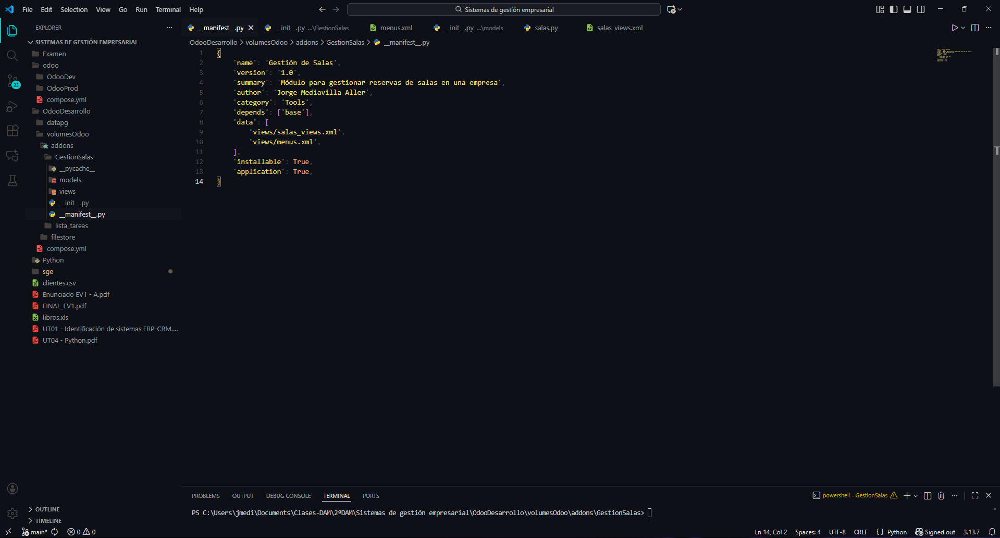
### Paso 2:
y dentro de innit:
```python
from . import models
```
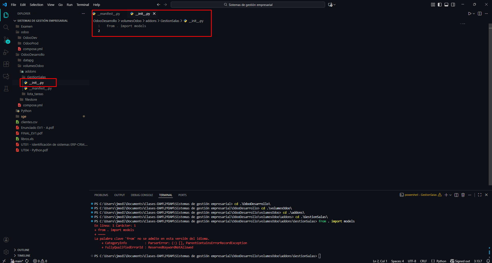
### Paso 3:
Crearemos una carpeta llamada models donde añadiremos otro archivo `__innit__.py` en el que incluiremos lo siguiente:
```python
from . import salas
```
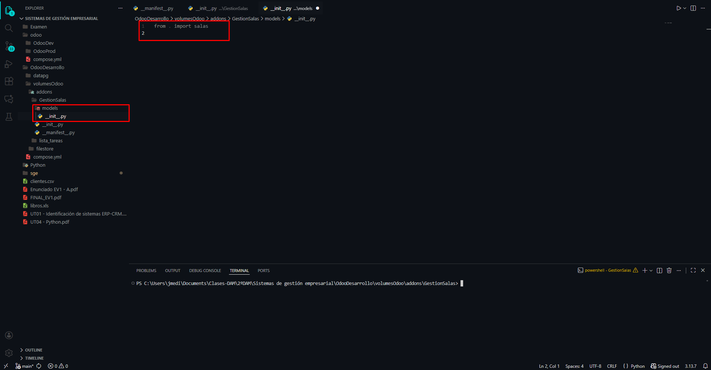
### Paso 4:
Y dentro de esta misma carpeta crearemos el archivo `salas.py`
y escribiremos dentro:
```python
from odoo import models, fields

class Sala(models.Model):
    _name = 'empresa.sala'
    _description = 'Sala de la empresa'

    nombre = fields.Char(string='Nombre de la Sala', required=True)
    capacidad = fields.Integer(string='Capacidad')
    fecha_reserva = fields.Date(string='Fecha de Reserva')
    reservada = fields.Boolean(string='Reservada')
    comentarios = fields.Text(string='Comentarios')

```
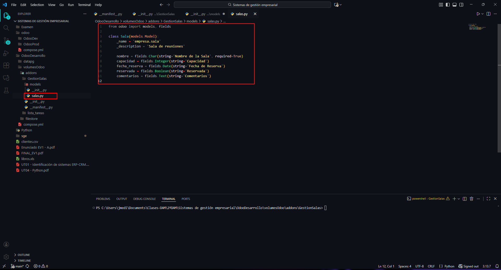
### Paso 5:
Ahora en la carpeta del modulo crearemos otra carpeta llamada `views` y dentro dos archivos `menus.xml`y `salas_views.xml`

En menus escribiremos:
```xml
<?xml version="1.0" encoding="UTF-8"?>
<odoo>

    <menuitem id="menu_gestion_salas" name="Gestión de salas"/>

    <menuitem id="menu_salas"
              name="Salas"
              parent="menu_gestion_salas"/>

    <menuitem id="menu_salas_disponibles"
              name="Salas Disponibles"
              parent="menu_salas"
              action="action_salas_disponibles"/>

    <menuitem id="menu_salas_all"
              name="Todas las Salas"
              parent="menu_salas"
              action="action_salas"/>

    <menuitem id="menu_reservas"
              name="Reservas"
              parent="menu_gestion_salas"/>

    <menuitem id="menu_reservas_realizadas"
              name="Reservas Realizadas"
              parent="menu_reservas"/>
</odoo>
```

y en salas_views:

```xml
<?xml version="1.0" encoding="UTF-8"?>
<odoo>

    <record id="view_sala_tree" model="ir.ui.view">
        <field name="name">empresa.sala.tree</field>
        <field name="model">empresa.sala</field>
        <field name="arch" type="xml">
            <tree>
                <field name="nombre"/>
                <field name="capacidad"/>
                <field name="fecha_reserva"/>
                <field name="reservada"/>
            </tree>
        </field>
    </record>

    <record id="view_sala_form" model="ir.ui.view">
        <field name="name">empresa.sala.form</field>
        <field name="model">empresa.sala</field>
        <field name="arch" type="xml">
            <form>
                <sheet>
                    <group>
                        <field name="nombre"/>
                        <field name="capacidad"/>
                        <field name="fecha_reserva"/>
                        <field name="reservada"/>
                        <field name="comentarios"/>
                    </group>
                </sheet>
            </form>
        </field>
    </record>

    <record id="action_salas" model="ir.actions.act_window">
        <field name="name">Salas</field>
        <field name="res_model">empresa.sala</field>
        <field name="view_mode">tree,form</field>
    </record>

    <record id="action_salas_disponibles" model="ir.actions.act_window">
        <field name="name">Salas Disponibles</field>
        <field name="res_model">empresa.sala</field>
        <field name="view_mode">tree,form</field>
        <field name="domain">[('reservada', '=', False)]</field>
    </record>

</odoo>

```
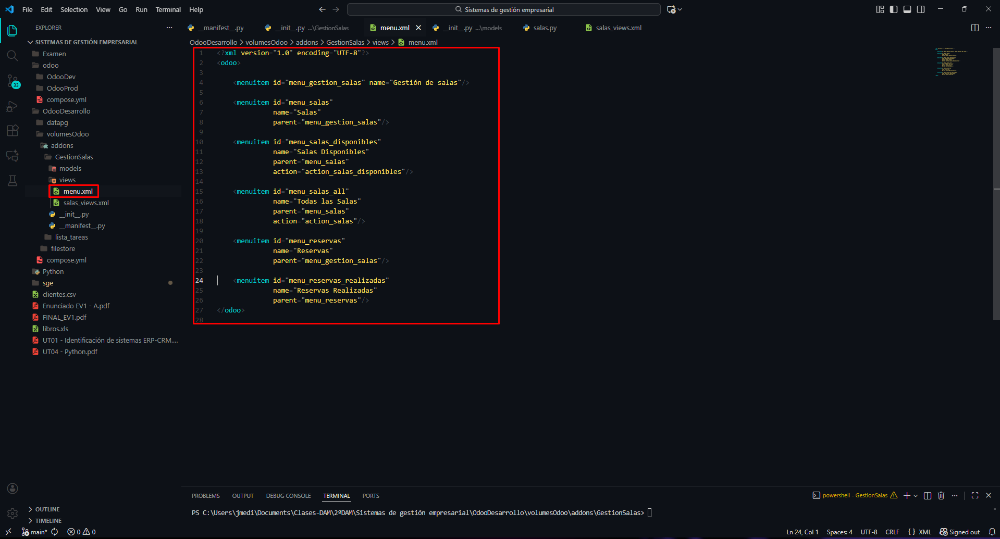
### Paso 6:
Ahora buscaremos en odoo el modulo y le daremos a activar
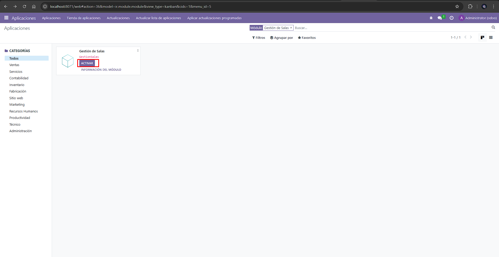
### Paso 7:
y luego a actualizar
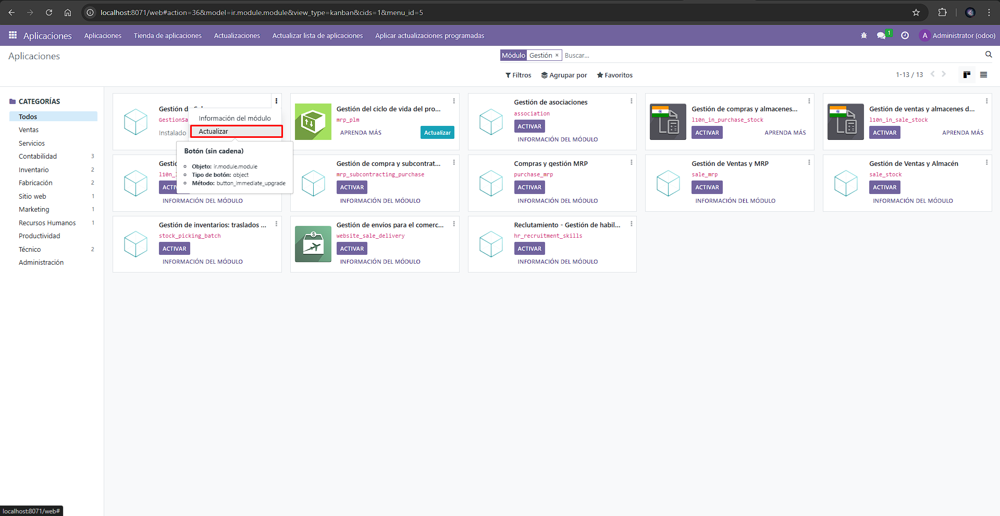
### Paso 8:
nos daremos cuenta de que no sale en el menu contextual de la izquierda, por lo que deberemos de crear dentro la carpeta del modulo la carpeta `security`y dentro de ella el archivo `ir.model.access.csv` donde escribiremos:
```csv
id,name,model_id:id,group_id:id,perm_read,perm_write,perm_create,perm_unlink
access_empresa_sala,empresa.sala,model_empresa_sala,,1,1,1,1
```
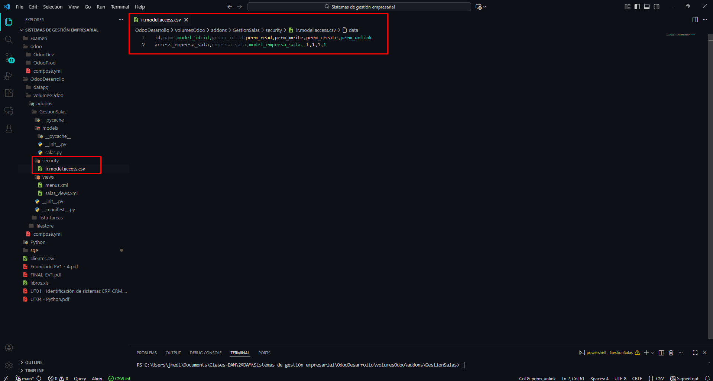

y en el `__innit__.py`del modulo añadiremos esta linea
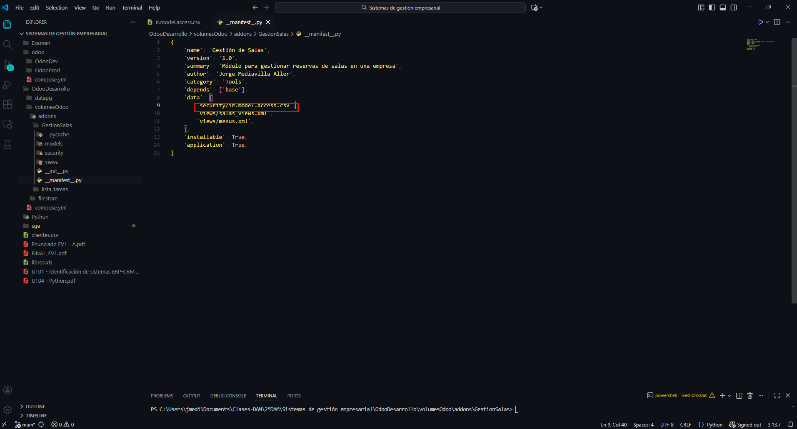
### Paso 9:
Ahora si nos sale, vamos a entrar
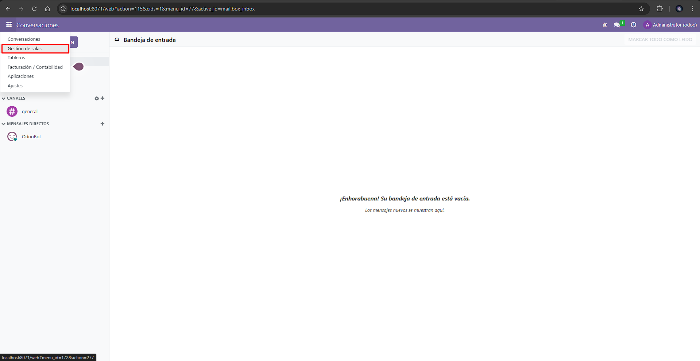
### Paso 10:
Vamos a crear una sala sin reservar para ponerlo de ejemplo y varias reservadas

### Paso 11:
podemos ver que salen solo las sin reservaar
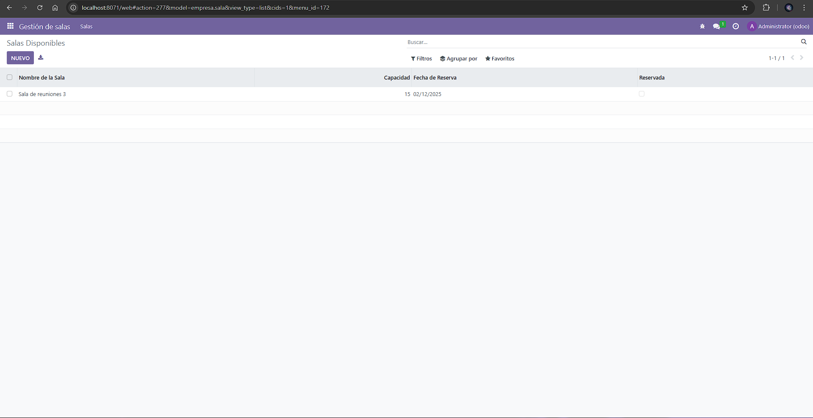
### Paso 12:
sin embargo si le damos a todas las salas nos salen también las reservadas

