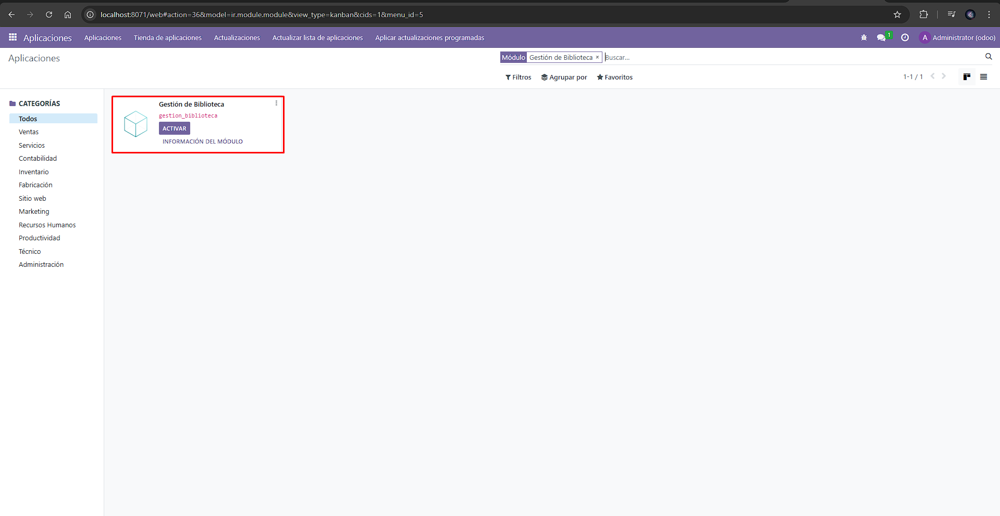
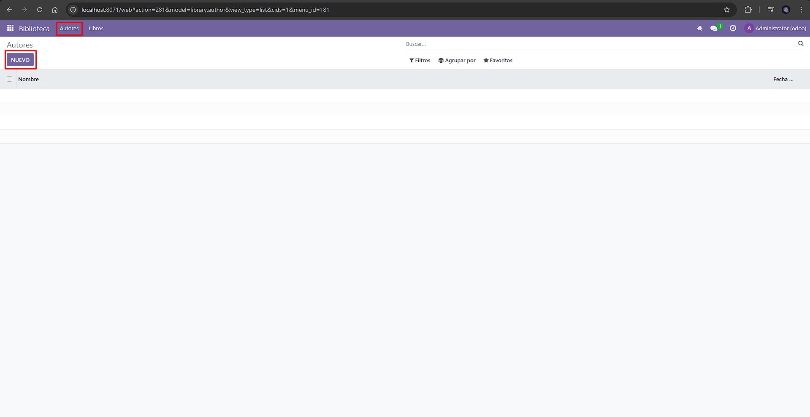
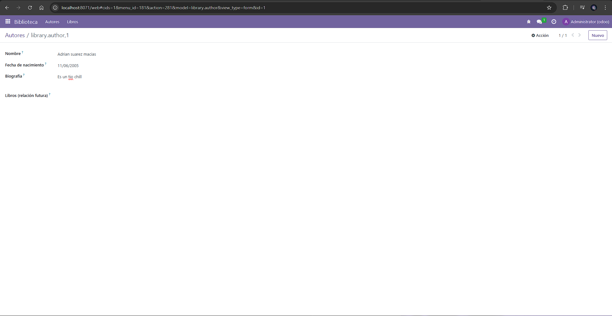
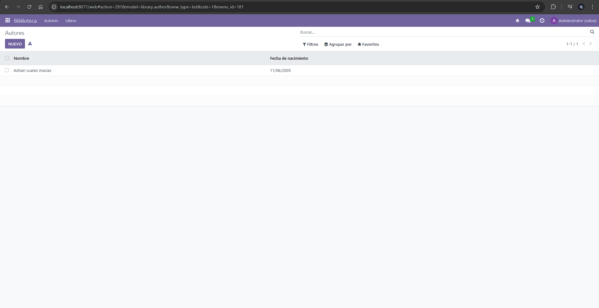
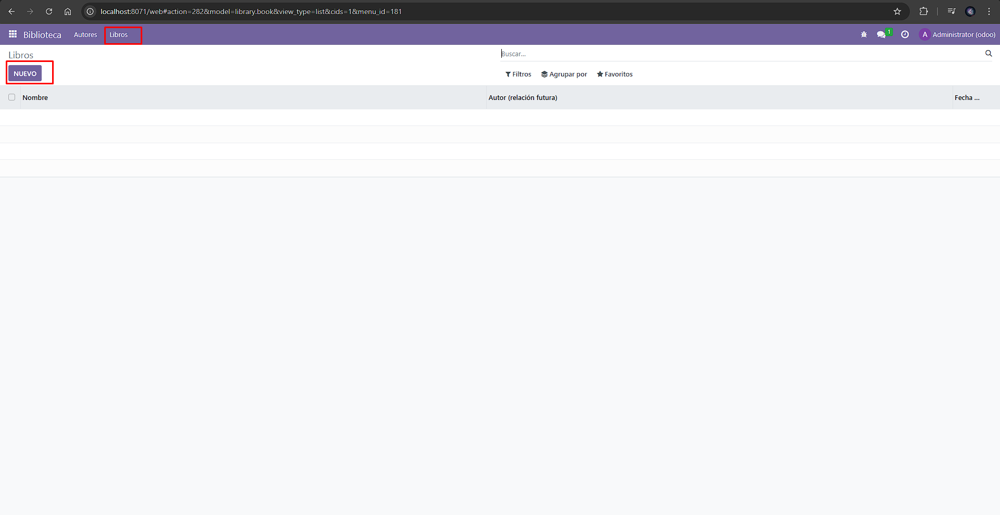
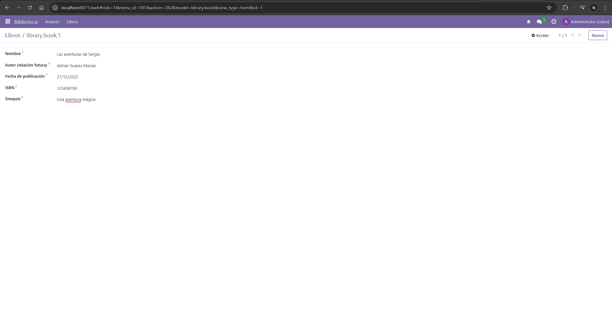
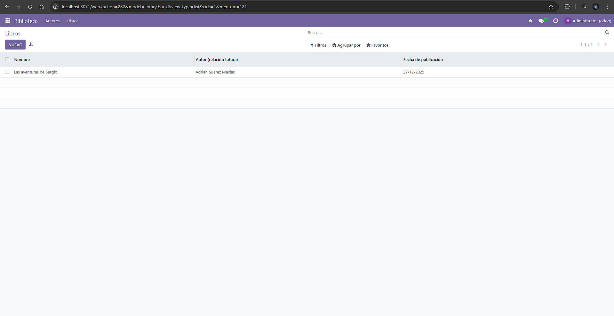

# [UT05](../../ut05/)

## PR0502

### Paso 1:
Modificaremos lo archivos, `__manifest__.py` y `__init__.py`

dentro de manifest escribiremos lo siguiente

```python
{
    'name': 'Gestión de Biblioteca',
    'version': '1.0',
    'summary': 'Módulo para gestionar los libros de una biblioteca',
    'author': 'Jorge Mediavilla Aller',
    'category': 'Tools',
    'depends': ['base'],
    'data': [
        'views/library_author_views.xml',
        'views/library_book_views.xml',
        'views/library_menu_views.xml',
        'security/ir.model.access.csv',
    ],
    'installable': True,
    'application': True,
}
```
y dentro de innit:

```python
from . import models
```
### Paso 2
dentro de la carpeta models crearemos dos archivos 

`library_author.py`

```python
from odoo import models, fields

class LibraryAuthor(models.Model):
    _name = 'library.author'
    _description = 'Autor de libros'

    nombre = fields.Char(string='Nombre', required=True)
    fecha_nacim = fields.Date(string='Fecha de nacimiento')
    biografia = fields.Text(string='Biografía')
    libros = fields.Text(string='Libros (relación futura)')
```

y `library_books.py`

```python
from odoo import models, fields

class LibraryBook(models.Model):
    _name = 'library.book'
    _description = 'Libro'

    nombre = fields.Char(string='Nombre', required=True)
    autor = fields.Char(string='Autor (relación futura)')
    fecha_publicacion = fields.Date(string='Fecha de publicación')
    isbn = fields.Char(string='ISBN')
    sinopsis = fields.Text(string='Sinopsis')

```
### Paso 3
dentro de la carpeta de views crearemos los siguientes archivos 

`library_author_views.xml`:

```xml
<?xml version="1.0" encoding="UTF-8"?>
<odoo>
    <record id="view_library_author_tree" model="ir.ui.view">
        <field name="name">library.author.tree</field>
        <field name="model">library.author</field>
        <field name="arch" type="xml">
            <tree>
                <field name="nombre"/>
                <field name="fecha_nacim"/>
            </tree>
        </field>
    </record>

    <record id="view_library_author_form" model="ir.ui.view">
        <field name="name">library.author.form</field>
        <field name="model">library.author</field>
        <field name="arch" type="xml">
            <form>
                <group>
                    <field name="nombre"/>
                    <field name="fecha_nacim"/>
                    <field name="biografia"/>
                    <field name="libros"/>
                </group>
            </form>
        </field>
    </record>

    <record id="action_library_author" model="ir.actions.act_window">
        <field name="name">Autores</field>
        <field name="res_model">library.author</field>
        <field name="view_mode">tree,form</field>
    </record>
</odoo>
```

`library_book_views.xml`

```xml
<?xml version="1.0" encoding="UTF-8"?>
<odoo>
    <record id="view_library_book_tree" model="ir.ui.view">
        <field name="name">library.book.tree</field>
        <field name="model">library.book</field>
        <field name="arch" type="xml">
            <tree>
                <field name="nombre"/>
                <field name="autor"/>
                <field name="fecha_publicacion"/>
            </tree>
        </field>
    </record>

    <record id="view_library_book_form" model="ir.ui.view">
        <field name="name">library.book.form</field>
        <field name="model">library.book</field>
        <field name="arch" type="xml">
            <form>
                <group>
                    <field name="nombre"/>
                    <field name="autor"/>
                    <field name="fecha_publicacion"/>
                    <field name="isbn"/>
                    <field name="sinopsis"/>
                </group>
            </form>
        </field>
    </record>

    <record id="action_library_book" model="ir.actions.act_window">
        <field name="name">Libros</field>
        <field name="res_model">library.book</field>
        <field name="view_mode">tree,form</field>
    </record>
</odoo>
```

y `library_menu_views.xml`

```xml
<?xml version="1.0" encoding="UTF-8"?>
<odoo>
    <menuitem id="library_menu_root" name="Biblioteca"/>

    <menuitem id="library_menu_authors"
              name="Autores"
              parent="library_menu_root"
              sequence="10"
              action="action_library_author"/>

    <menuitem id="library_menu_books"
              name="Libros"
              parent="library_menu_root"
              sequence="20"
              action="action_library_book"/>
</odoo>
```

### Paso 4
En el `ir.model.access.csv`

```csv
id,name,model_id:id,group_id:id,perm_read,perm_write,perm_create,perm_unlink
access_library_author,access_library_author,model_library_author,,1,1,1,1
access_library_book,access_library_book,model_library_book,,1,1,1,1

```

### Paso 5
Comprobaremos si funciona







