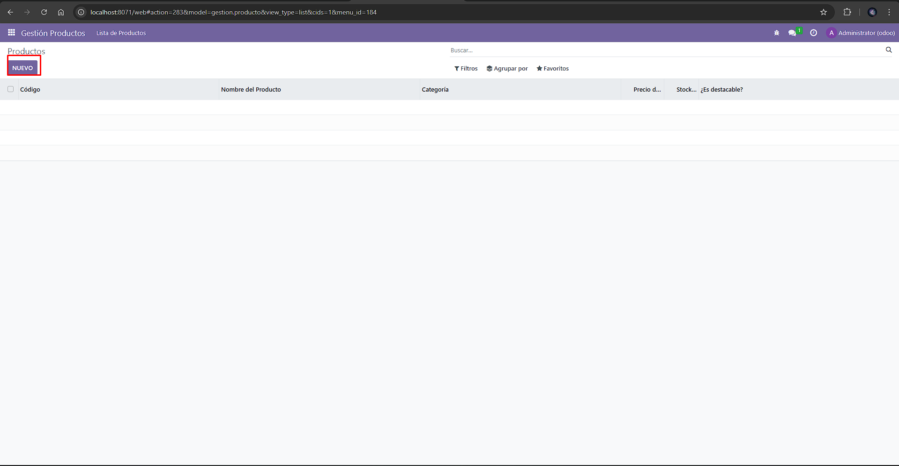
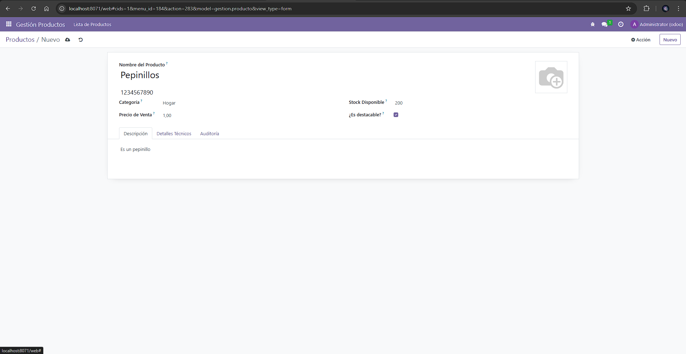
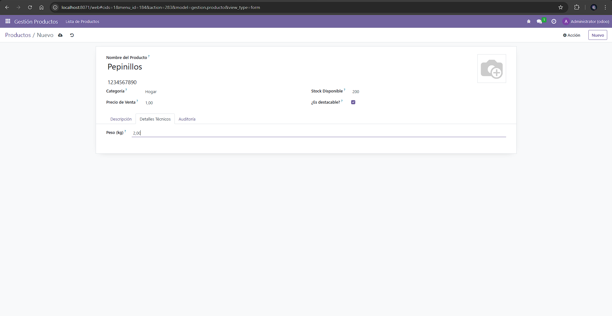
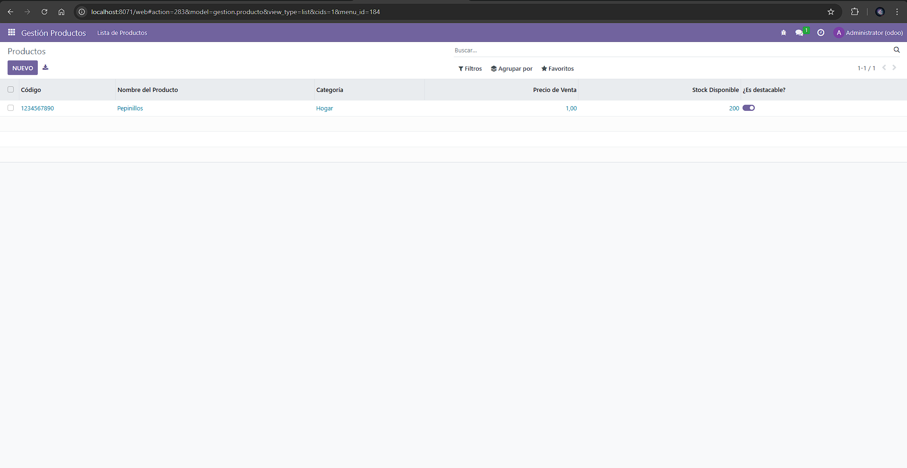

# [UT06](../../ut06/)

## PR0601

### Codigos

`models/Productos.py` 
```python
    from odoo import models, fields

class GestionProducto(models.Model):
    _name = 'gestion.producto'
    _description = 'Modelo de Gestión de Productos'
    _rec_name = 'name'

    name = fields.Char(
        string='Nombre del Producto', 
        required=True
    )
    
    code = fields.Char(
        string='Código', 
        required=True,
        help='Identificador único del producto'
    )
    
    description = fields.Text(
        string='Descripción'
    )
    
    image = fields.Binary(
        string='Imagen',
        attachment=True
    )

    category = fields.Selection(
        [('jardin', 'Jardín'),
         ('hogar', 'Hogar'),
         ('electro', 'Electrodomésticos')],
        string='Categoría'
    )

    is_featured = fields.Boolean(
        string='¿Es destacable?',
        default=False
    )

    price = fields.Float(
        string='Precio de Venta',
        digits=(10, 2) 
    )

    stock = fields.Integer(
        string='Stock Disponible',
        default=0
    )

    active = fields.Boolean(
        string='Activo',
        default=True,
        help="Si se desmarca, el producto se ocultará sin borrarse."
    )

    weight = fields.Float(
        string='Peso (kg)',
        digits=(6, 2),
        help="Peso del producto con dos decimales."
    )
```

`views/producto_views.xml`
```xml
    <?xml version="1.0" encoding="utf-8"?>
<odoo>
    
    <record id="view_gestion_producto_form" model="ir.ui.view">
        <field name="name">gestion.producto.form</field>
        <field name="model">gestion.producto</field>
        <field name="arch" type="xml">
            <form string="Producto">
                <sheet>
                    <field name="image" widget="image" class="oe_avatar"/>
                    <div class="oe_title">
                        <label for="name" class="oe_edit_only"/>
                        <h1><field name="name"/></h1>
                        <h3><field name="code" placeholder="Código de referencia"/></h3>
                    </div>

                    <group>
                        <group>
                            <field name="category"/>
                            <field name="price" widget="monetary"/>
                        </group>
                        <group>
                            <field name="stock"/>
                            <field name="is_featured"/>
                            <field name="active" invisible="1"/> </group>
                    </group>

                    <notebook>
                        <page string="Descripción">
                            <field name="description"/>
                        </page>
                        <page string="Detalles Técnicos">
                            <group>
                                <field name="weight"/>
                            </group>
                        </page>
                        <page string="Auditoría">
                            <group>
                                <field name="create_date" string="Fecha de creación" readonly="1"/>
                                <field name="write_date" string="Última actualización" readonly="1"/>
                            </group>
                        </page>
                    </notebook>
                </sheet>
            </form>
        </field>
    </record>

    <record id="view_gestion_producto_tree" model="ir.ui.view">
        <field name="name">gestion.producto.tree</field>
        <field name="model">gestion.producto</field>
        <field name="arch" type="xml">
            <tree string="Productos" decoration-info="is_featured==True">
                <field name="code"/>
                <field name="name"/>
                <field name="category"/>
                <field name="price"/>
                <field name="stock"/>
                <field name="is_featured" widget="boolean_toggle"/>
            </tree>
        </field>
    </record>

    <record id="action_gestion_producto" model="ir.actions.act_window">
        <field name="name">Productos</field>
        <field name="type">ir.actions.act_window</field>
        <field name="res_model">gestion.producto</field>
        <field name="view_mode">tree,form</field>
    </record>

    <menuitem id="menu_gestion_producto_root" name="Gestión Productos" sequence="10"/>
    <menuitem id="menu_gestion_producto_list" name="Lista de Productos" parent="menu_gestion_producto_root" action="action_gestion_producto"/>
</odoo>
```
`security/ir.model.access.csv`
```csv
id,name,model_id:id,group_id:id,perm_read,perm_write,perm_create,perm_unlink
access_gestion_producto,access.gestion.producto,model_gestion_producto,base.group_user,1,1,1,1
```

### Funcionamiento
Instalacion

Creacion de nuevo producto



Vista del producto


