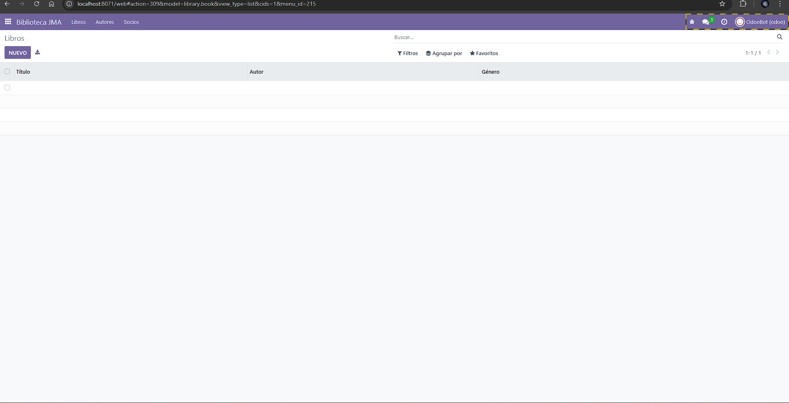
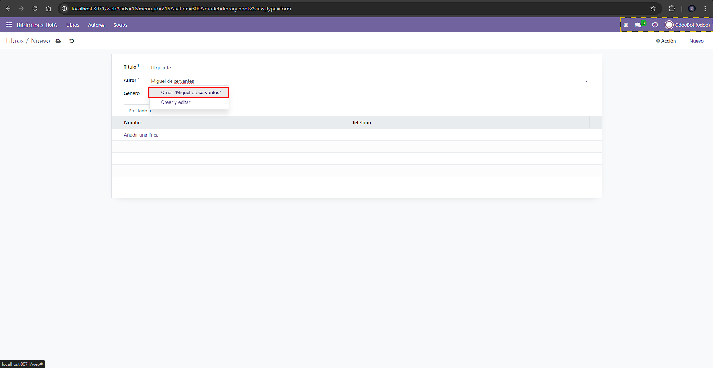
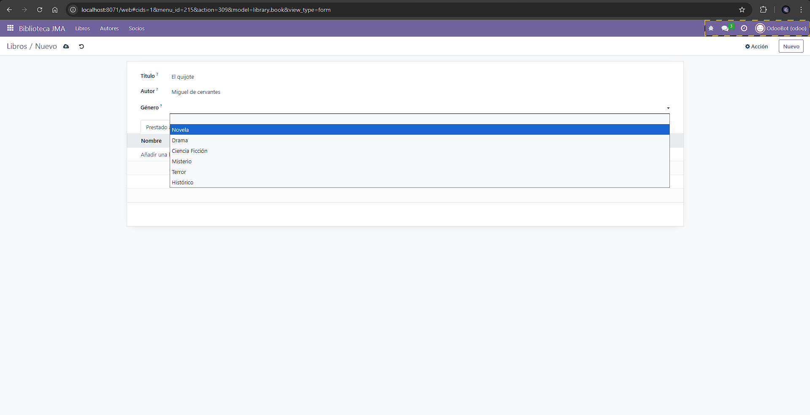
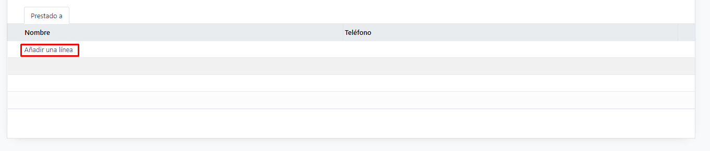
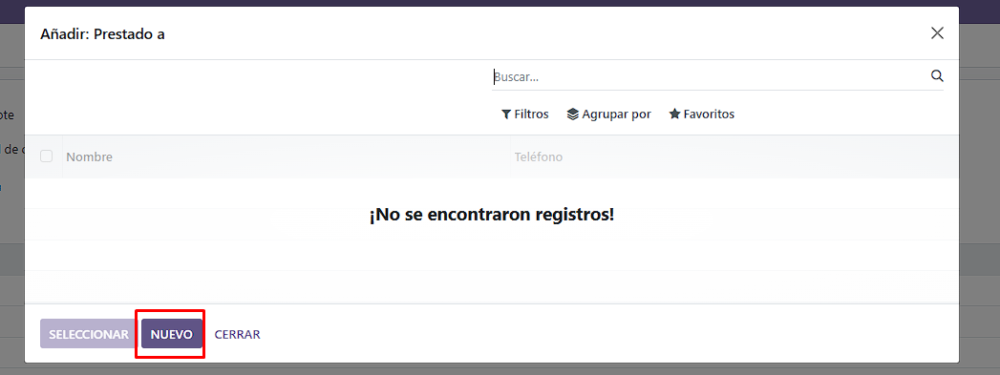
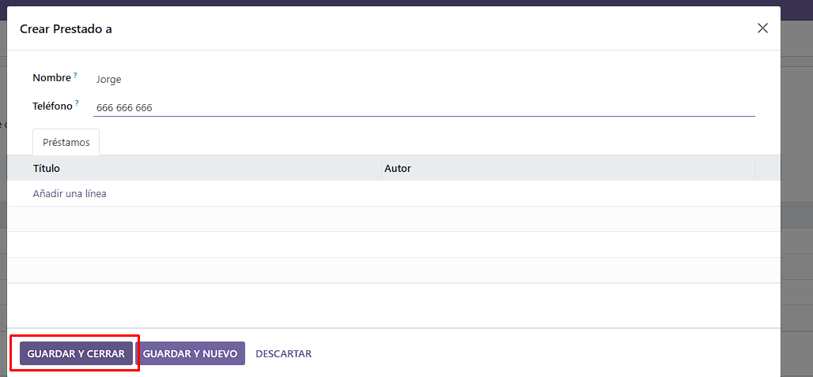
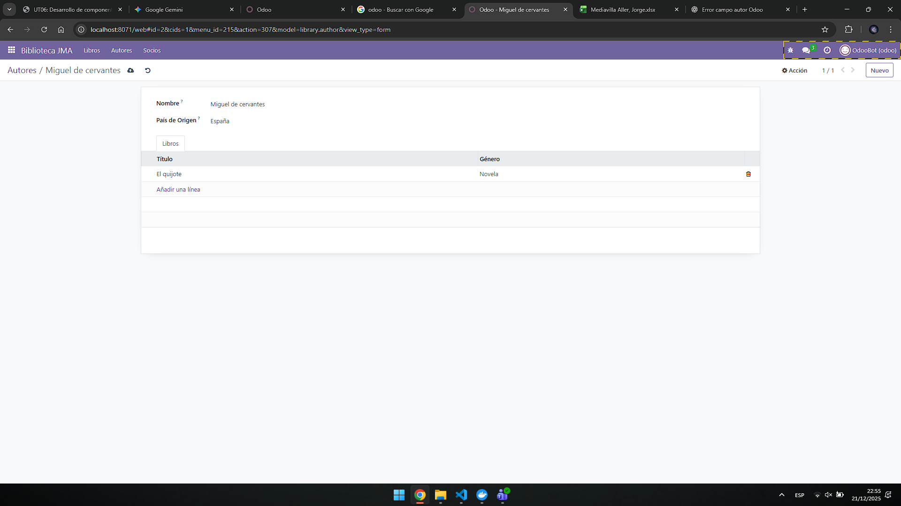
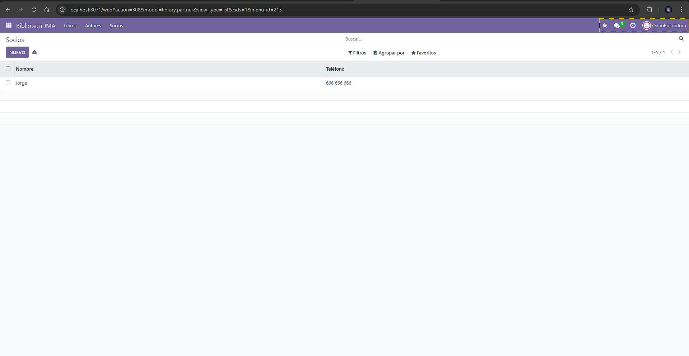

# [UT06](../../ut06/)

## PR0601

### Codigos

`views/library_author`
```xml
<?xml version="1.0" encoding="utf-8"?>
<odoo>
    <record id="view_library_author_form" model="ir.ui.view">
        <field name="name">library.author.form</field>
        <field name="model">library.author</field>
        <field name="arch" type="xml">
            <form>
                <sheet>
                    <group>
                        <field name="name"/>
                        <field name="country_id"/>
                    </group>
                    <notebook>
                        <page string="Libros">
                            <field name="book_ids">
                                <tree>
                                    <field name="name"/>
                                    <field name="genre"/>
                                </tree>
                            </field>
                        </page>
                    </notebook>
                </sheet>
            </form>
        </field>
    </record>

    <record id="view_library_author_tree" model="ir.ui.view">
        <field name="name">library.author.tree</field>
        <field name="model">library.author</field>
        <field name="arch" type="xml">
            <tree>
                <field name="name"/>
                <field name="country_id"/>
            </tree>
        </field>
    </record>

    <record id="action_library_author" model="ir.actions.act_window">
        <field name="name">Autores</field>
        <field name="res_model">library.author</field>
        <field name="view_mode">tree,form</field>
    </record>
</odoo>
```
`views/library_book`
```xml
<odoo>
    <record id="view_library_book_form" model="ir.ui.view">
        <field name="name">library.book.form</field>
        <field name="model">library.book</field>
        <field name="arch" type="xml">
            <form>
                <sheet>
                    <group>
                        <field name="name"/>
                        <field name="author_id"/>
                        <field name="genre"/>
                    </group>
                    <notebook>
                        <page string="Prestado a">
                            <field name="partner_ids"/>
                        </page>
                    </notebook>
                </sheet>
            </form>
        </field>
    </record>

    <record id="view_library_book_tree" model="ir.ui.view">
        <field name="name">library.book.tree</field>
        <field name="model">library.book</field>
        <field name="arch" type="xml">
            <tree>
                <field name="name"/>
                <field name="author_id"/>
                <field name="genre"/>
            </tree>
        </field>
    </record>

    <record id="action_library_book" model="ir.actions.act_window">
        <field name="name">Libros</field>
        <field name="res_model">library.book</field>
        <field name="view_mode">tree,form</field>
    </record>

    <menuitem id="menu_library_root"
          name="Biblioteca jma"
          sequence="10"/>

</odoo>

```
`views/library_menu`
```xml
<?xml version="1.0" encoding="utf-8"?>
<odoo>

    <menuitem
        id="menu_library_root"
        name="Biblioteca JMA"
        sequence="10"
        web_icon="library,static/description/icon.png"
    />

    <menuitem
        id="menu_library_books"
        name="Libros"
        parent="menu_library_root"
        action="action_library_book"
        sequence="1"
    />

    <menuitem
        id="menu_library_authors"
        name="Autores"
        parent="menu_library_root"
        action="action_library_author"
        sequence="2"
    />

    <menuitem
        id="menu_library_partners"
        name="Socios"
        parent="menu_library_root"
        action="action_library_partner"
        sequence="3"
    />

</odoo>

```
`views/library_partner`
```xml
<?xml version="1.0" encoding="utf-8"?>
<odoo>
    <record id="view_library_partner_form" model="ir.ui.view">
        <field name="name">library.partner.form</field>
        <field name="model">library.partner</field>
        <field name="arch" type="xml">
            <form>
                <sheet>
                    <group>
                        <field name="name"/>
                        <field name="phone"/>
                    </group>
                    <notebook>
                        <page string="Préstamos">
                            <field name="book_ids">
                                <tree>
                                    <field name="name"/>
                                    <field name="author_id"/>
                                </tree>
                            </field>
                        </page>
                    </notebook>
                </sheet>
            </form>
        </field>
    </record>

    <record id="view_library_partner_tree" model="ir.ui.view">
        <field name="name">library.partner.tree</field>
        <field name="model">library.partner</field>
        <field name="arch" type="xml">
            <tree>
                <field name="name"/>
                <field name="phone"/>
            </tree>
        </field>
    </record>

    <record id="action_library_partner" model="ir.actions.act_window">
        <field name="name">Socios</field>
        <field name="res_model">library.partner</field>
        <field name="view_mode">tree,form</field>
    </record>
</odoo>
```

`security/ir.model.access.csv`
```csv
id,name,model_id:id,group_id:id,perm_read,perm_write,perm_create,perm_unlink
access_library_book,access.library.book,model_library_book,base.group_user,1,1,1,1
access_library_author,access.library.author,model_library_author,base.group_user,1,1,1,1
access_library_partner,access.library.partner,model_library_partner,base.group_user,1,1,1,1
```

### Funcionamiento
Instalacion


Creacion de nuevo libro



Añadir un socio desde libros



Edicion autor o creacion de nuevo


Socios

