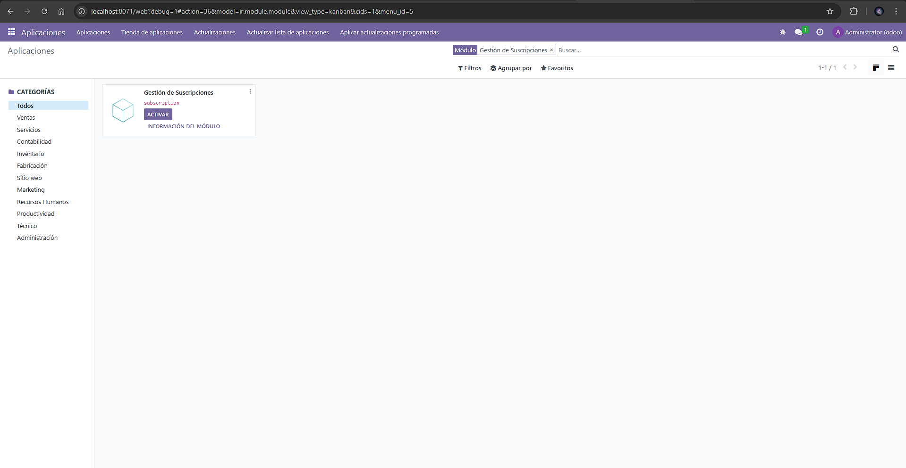
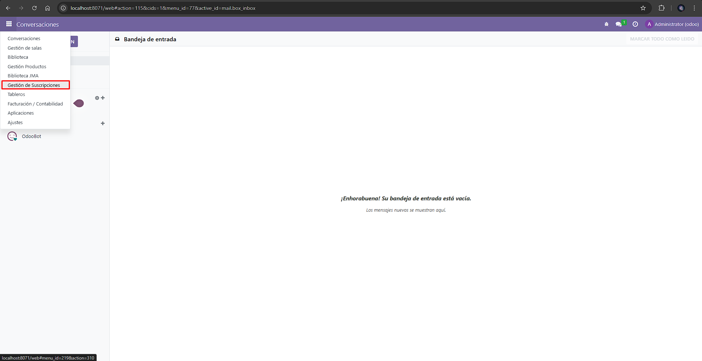
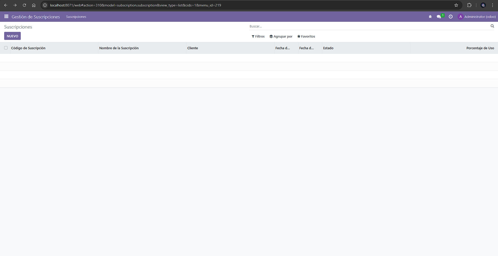
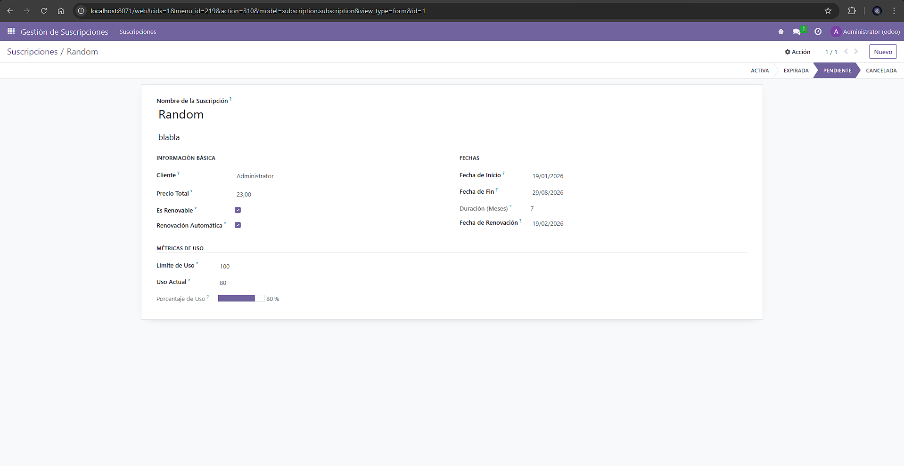
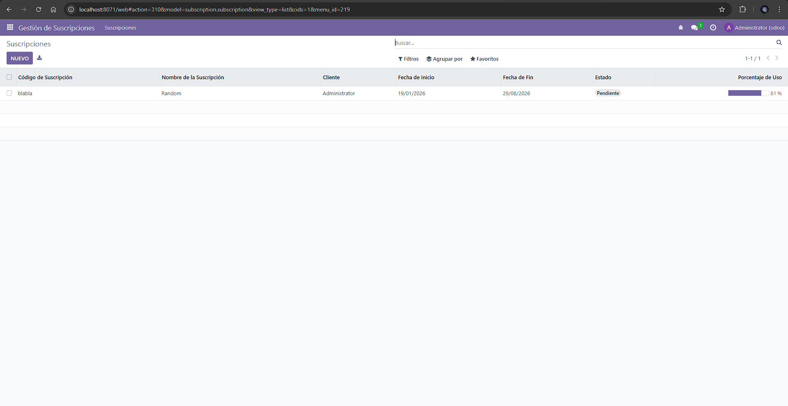

# [UT06](../../ut06/)

## PR0604

### Codigos
`views/subscription_views.xml`
```xml
<?xml version="1.0" encoding="utf-8"?>
<odoo>
    <record id="view_subscription_form" model="ir.ui.view">
        <field name="name">subscription.subscription.form</field>
        <field name="model">subscription.subscription</field>
        <field name="arch" type="xml">
            <form string="Suscripción">
                <header>
                    <field name="status" widget="statusbar" options="{'clickable': '1'}"/>
                </header>
                <sheet>
                    <div class="oe_title">
                        <label for="name" class="oe_edit_only"/>
                        <h1><field name="name"/></h1>
                        <h3><field name="subscription_code"/></h3>
                    </div>
                    <group>
                        <group string="Información Básica">
                            <field name="customer_id"/>
                            <field name="price" widget="monetary"/>
                            <field name="is_renewable"/>
                            <field name="auto_renewal"/>
                        </group>
                        <group string="Fechas">
                            <field name="start_date"/>
                            <field name="end_date"/>
                            <field name="duration_months"/>
                            <field name="renewal_date"/>
                        </group>
                    </group>
                    <group string="Métricas de Uso">
                        <field name="usage_limit"/>
                        <field name="current_usage"/>
                        <field name="use_percent" widget="progressbar"/>
                    </group>
                </sheet>
            </form>
        </field>
    </record>

    <record id="view_subscription_tree" model="ir.ui.view">
        <field name="name">subscription.subscription.tree</field>
        <field name="model">subscription.subscription</field>
        <field name="arch" type="xml">
            <tree string="Suscripciones">
                <field name="subscription_code"/>
                <field name="name"/>
                <field name="customer_id"/>
                <field name="start_date"/>
                <field name="end_date"/>
                <field name="status" widget="badge" decoration-success="status == 'active'" decoration-danger="status == 'expired'"/>
                
                <field name="use_percent" widget="progressbar" decoration-danger="use_percent > 80"/>
            </tree>
        </field>
    </record>

    <record id="action_subscription" model="ir.actions.act_window">
        <field name="name">Suscripciones</field>
        <field name="res_model">subscription.subscription</field>
        <field name="view_mode">tree,form</field>
    </record>

    <menuitem id="menu_subscription_root" name="Gestión de Suscripciones" sequence="10"/>
    <menuitem id="menu_subscription_main" name="Suscripciones" parent="menu_subscription_root" action="action_subscription"/>
</odoo>
```
`security/ir.model.access.csv`
```csv
id,name,model_id:id,group_id:id,perm_read,perm_write,perm_create,perm_unlink
access_subscription_subscription,subscription.subscription,model_subscription_subscription,base.group_user,1,1,1,1
```
`models/subscription.py`
```python
from odoo import models, fields, api
from dateutil.relativedelta import relativedelta

class Subscription(models.Model):
    _name = 'subscription.subscription'
    _description = 'Gestión de Suscripciones'

    name = fields.Char(
        string='Nombre de la Suscripción',
        required=True,
        help='Nombre o identificador único (ej. Suscripción Premium)'
    )

    customer_id = fields.Many2one(
        'res.partner',
        string='Cliente',
        required=True
    )
    subscription_code = fields.Char(
        string='Código de Suscripción',
        required=True,
        copy=False
    )
    start_date = fields.Date(
        string='Fecha de Inicio',
        required=True,
        default=fields.Date.today
    )
    end_date = fields.Date(
        string='Fecha de Fin'
    )
    duration_months = fields.Integer(
        string='Duración (Meses)',
        compute='_compute_duration_months',
        store=True,
        help='Número de meses calculado automáticamente'
    )
    renewal_date = fields.Date(
        string='Fecha de Renovación'
    )
    status = fields.Selection(
        [('active', 'Activa'),
         ('expired', 'Expirada'),
         ('pending', 'Pendiente'),
         ('cancelled', 'Cancelada')],
        string='Estado',
        default='pending'
    )
    is_renewable = fields.Boolean(
        string='Es Renovable'
    )
    auto_renewal = fields.Boolean(
        string='Renovación Automática'
    )
    price = fields.Float(
        string='Precio Total',
        digits=(10, 2)
    )
    usage_limit = fields.Integer(
        string='Límite de Uso'
    )
    current_usage = fields.Integer(
        string='Uso Actual',
        default=0
    )
    use_percent = fields.Float(
        string='Porcentaje de Uso',
        compute='_compute_use_percent',
        store=False
    )

    @api.depends('start_date', 'end_date') # Cuando uo de los campos que hay dentro, se ejecuta la funcion
    def _compute_duration_months(self):
        for record in self:
            if record.start_date and record.end_date:
                delta = relativedelta(record.end_date, record.start_date)
                record.duration_months = (delta.years * 12) + delta.months
            else:
                record.duration_months = 0

    @api.depends('current_usage', 'usage_limit')
    def _compute_use_percent(self):
        for record in self:
            if record.usage_limit > 0:
                record.use_percent = (record.current_usage / record.usage_limit) * 100
            else:
                record.use_percent = 0.0
```

### Imagenes




