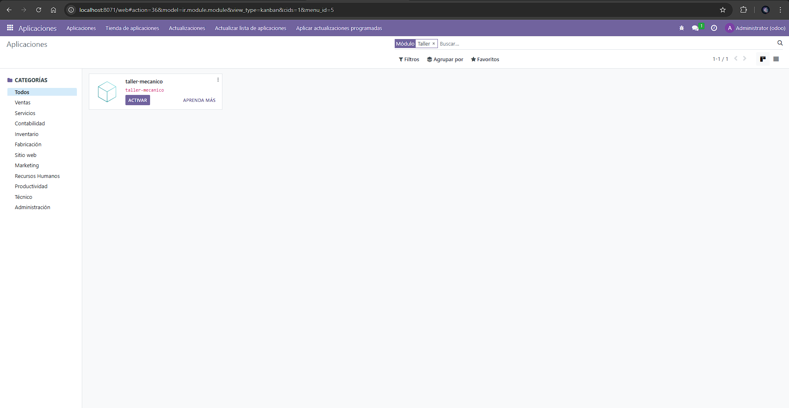
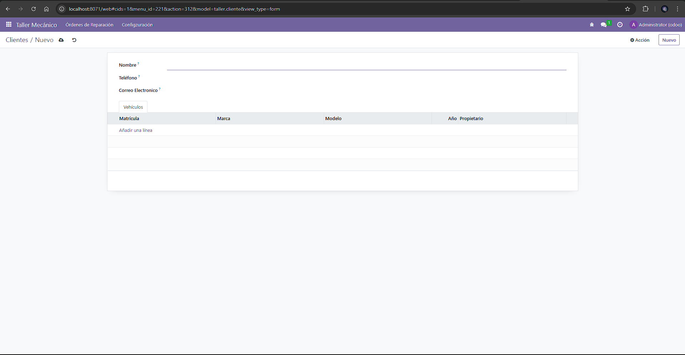
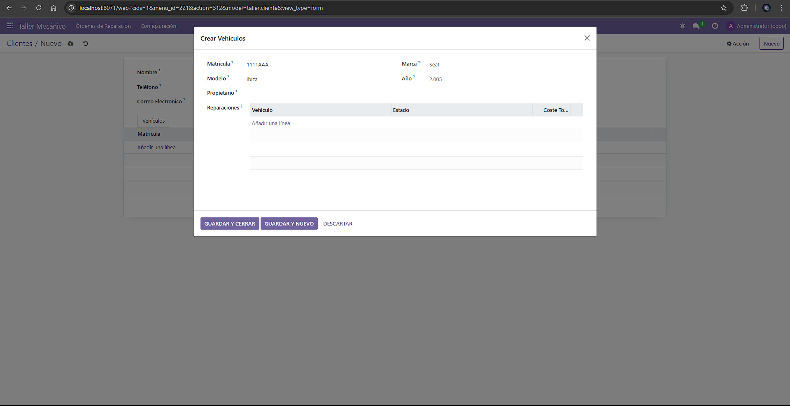
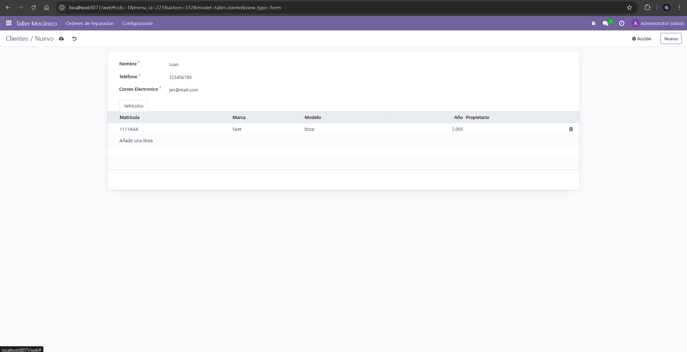
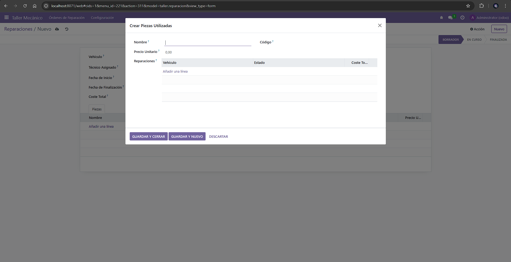
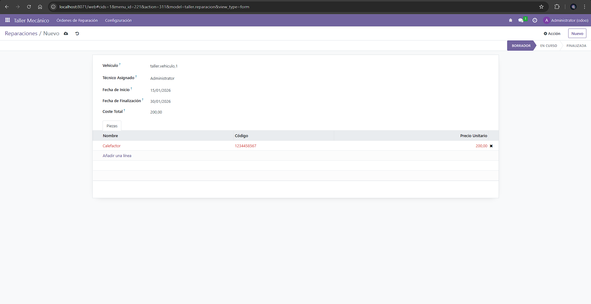

# [UT06](../../ut06/)

## PR0606

### Codigos
`models\taller_cliente.py`
```python
from odoo import models, fields, api

class TallerCliente(models.Model):
    _name = 'taller.cliente'

    nombre = fields.Char(string='Nombre', required=True)
    telefono = fields.Char(string='Teléfono')
    email = fields.Char(string='Correo Electronico')
    direccion = fields.Char(string='Direccion Cliente')
    
    vehiculo_ids = fields.One2many('taller.vehiculo', 'cliente_id', string='Vehículos')
```
`models\taller_pieza.py`
```python
from odoo import models, fields, api
from odoo.exceptions import ValidationError

class TallerPieza(models.Model):
    _name = 'taller.pieza'
    _description = 'Piezas'

    nombre = fields.Char(string='Nombre', required=True)
    codigo = fields.Char(string='Código')
    precio_unitario = fields.Float(string='Precio Unitario')
    reparacion_ids = fields.Many2many('taller.reparacion', string='Reparaciones')

    @api.constrains('precio_unitario')
    def _check_precio(self):
        for record in self:
            if record.precio_unitario <= 0:
                raise ValidationError("El precio debe ser superior a 0")
```
`models\taller_reparaciones.py`
```python
from odoo import models, fields, api

class TallerReparacion(models.Model):
    _name = 'taller.reparacion'

    fecha_inicio = fields.Date(string='Fecha de Inicio', default=fields.Date.today)
    fecha_fin = fields.Date(string='Fecha de Finalización')
    descripcion = fields.Text(string='Descripción del Fallo')
    estado = fields.Selection([
            ('borrador', 'Borrador'),
            ('en_curso', 'En Curso'),
            ('finalizada', 'Finalizada')
        ], string='Estado', default='borrador')
    
    vehiculo_id = fields.Many2one('taller.vehiculo', string='Vehículo', required=True)
    tecnico_id = fields.Many2one('res.users', string='Técnico Asignado')
    pieza_ids = fields.Many2many('taller.pieza', string='Piezas Utilizadas')

    coste_total = fields.Float(string='Coste Total', compute='_compute_coste_total', store=True)

    @api.depends('pieza_ids.precio_unitario')
    def _compute_coste_total(self):
        for record in self:
            record.coste_total = sum(record.pieza_ids.mapped('precio_unitario'))

    def action_abrir(self):
        for record in self: record.estado = 'en_curso'
            
    def action_cerrar(self):
        for record in self: record.estado = 'finalizada'
            
    def action_reabrir(self):
        for record in self: record.estado = 'borrador'
```
`models\taller_vehiclo.py`
```python
from odoo import models, fields, api

class TallerVehiculo(models.Model):
    _name = 'taller.vehiculo'
    _description = 'Vehículos'

    matricula = fields.Char(string='Matrícula', required=True)
    marca = fields.Char(string='Marca')
    modelo = fields.Char(string='Modelo')
    anio = fields.Integer(string='Año')

    cliente_id = fields.Many2one(comodel_name='taller.cliente', string='Propietario')
    reparacion_ids = fields.One2many('taller.reparacion', 'vehiculo_id', string='Reparaciones')
```
`views\taller_cliente`
```xml
<odoo>
    <record id="view_taller_cliente_form" model="ir.ui.view">
        <field name="name">taller.cliente.form</field>
        <field name="model">taller.cliente</field>
        <field name="arch" type="xml">
            <form string="Cliente">
                <sheet>
                    <group>
                        <field name="nombre"/>
                        <field name="telefono"/>
                        <field name="email"/>
                    </group>
                    <notebook>
                        <page string="Vehículos">
                            <field name="vehiculo_ids"/>
                        </page>
                    </notebook>
                </sheet>
            </form>
        </field>
    </record>
</odoo>
```
`views\taller_menus`
```xml
<odoo>
    <record id="action_taller_reparacion" model="ir.actions.act_window">
        <field name="name">Reparaciones</field>
        <field name="res_model">taller.reparacion</field>
        <field name="view_mode">tree,form</field>
    </record>

    <record id="action_taller_cliente" model="ir.actions.act_window">
        <field name="name">Clientes</field>
        <field name="res_model">taller.cliente</field>
        <field name="view_mode">tree,form</field>
    </record>

    <menuitem id="menu_taller_root" name="Taller Mecánico" sequence="10"/>
    
    <menuitem id="menu_taller_reparacion" name="Órdenes de Reparación" 
              parent="menu_taller_root" action="action_taller_reparacion" sequence="10"/>
              
    <menuitem id="menu_taller_config" name="Configzuración" 
              parent="menu_taller_root" sequence="100"/>
              
    <menuitem id="menu_taller_cliente" name="Clientes" 
              parent="menu_taller_config" action="action_taller_cliente"/>
</odoo>
```
`views\taller_pieza`
```xml
<?xml version="1.0" encoding="utf-8"?>
<odoo>
    <record id="view_taller_pieza_tree" model="ir.ui.view">
        <field name="name">taller.pieza.tree</field>
        <field name="model">taller.pieza</field>
        <field name="arch" type="xml">
            <tree decoration-success="precio_unitario &lt; 10" 
                decoration-danger="precio_unitario &gt; 100">
                <field name="nombre"/>
                <field name="codigo"/>
                <field name="precio_unitario"/>
            </tree>
        </field>
    </record>
</odoo>
```
`views\taller_reparacion`
```xml
<?xml version="1.0" encoding="utf-8"?>
<odoo>
    <record id="view_taller_reparacion_form" model="ir.ui.view">
        <field name="name">taller.reparacion.form</field>
        <field name="model">taller.reparacion</field>
        <field name="arch" type="xml">
            <form>
                <header>
                    <button name="action_abrir" string="Abrir reparación" type="object" states="borrador" class="btn-primary"/>
                    <button name="action_cerrar" string="Cerrar reparación" type="object" states="en_curso" class="btn-primary"/>
                    <button name="action_reabrir" string="Reabrir" type="object" states="finalizada"/>
                    <field name="estado" widget="statusbar"/>
                </header>
                <sheet>
                    <group>
                        <field name="vehiculo_id" attrs="{'readonly': [('estado', '=', 'finalizada')]}"/>
                        <field name="tecnico_id" attrs="{'readonly': [('estado', '=', 'finalizada')]}"/>
                        <field name="fecha_inicio" attrs="{'readonly': [('estado', '=', 'finalizada')]}"/>
                        <field name="fecha_fin" attrs="{'readonly': [('estado', '=', 'finalizada')]}"/>
                        <field name="coste_total" attrs="{'readonly': [('estado', '=', 'finalizada')]}"/>
                    </group>
                    <notebook>
                        <page string="Piezas">
                            <field name="pieza_ids" attrs="{'readonly': [('estado', '=', 'finalizada')]}"/>
                        </page>
                    </notebook>
                </sheet>
            </form>
        </field>
    </record>

    <record id="view_taller_reparacion_tree" model="ir.ui.view">
        <field name="name">taller.reparacion.tree</field>
        <field name="model">taller.reparacion</field>
        <field name="arch" type="xml">
            <tree>
                <field name="vehiculo_id"/>
                <field name="estado" widget="badge" 
                       decoration-info="estado == 'en_curso'" 
                       decoration-success="estado == 'finalizada'" 
                       decoration-muted="estado == 'borrador'"/>
                <field name="coste_total" 
                       decoration-danger="coste_total &gt; 500" 
                       decoration-warning="coste_total &gt;= 100 and coste_total &lt;= 500" 
                       decoration-success="coste_total &lt; 100"/>
            </tree>
        </field>
    </record>
</odoo>
```
`views\taller_vehiculo`
```xml
<?xml version="1.0" encoding="utf-8"?>
<odoo>
    <record model="ir.ui.view" id="view_taller_vehiculo_tree">
        <field name="name">taller.vehiculo.tree</field> <field name="model">taller.vehiculo</field> <field name="arch" type="xml"> <tree default_order="matricula"> <field name="matricula"/>
                <field name="marca"/>
                <field name="modelo"/>
                <field name="anio"/>
                <field name="cliente_id"/>
            </tree>
            
        </field>
    </record>
</odoo>
```
### IMAGENES





