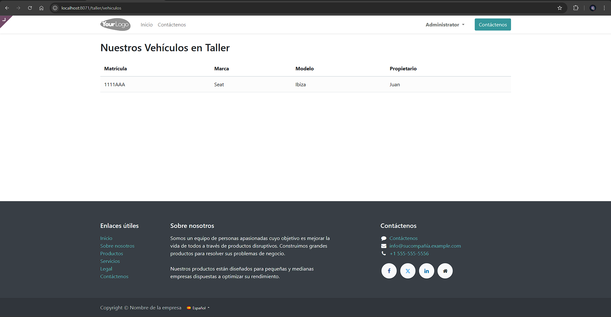
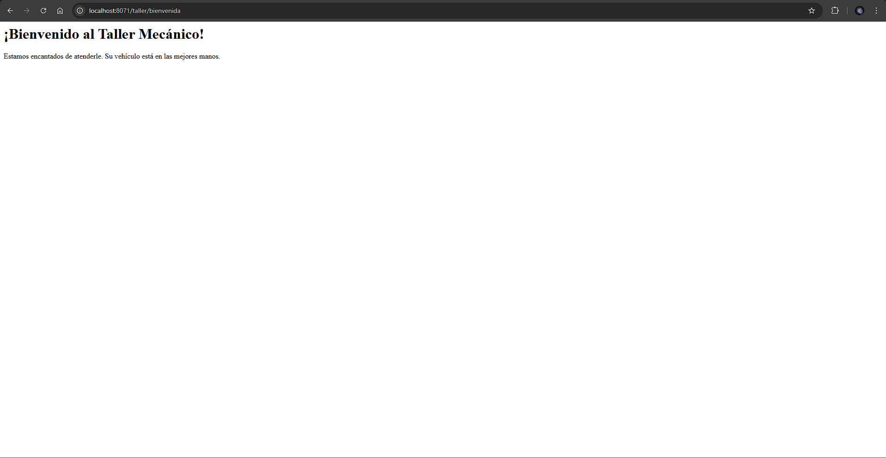

# [UT07](../../ut07/)

## PR0701

### Codigos
`controllers\controllers.py`
```python
# -*- coding: utf-8 -*-
from odoo import http
from odoo.http import request

class TallerController(http.Controller):

    @http.route('/taller/bienvenida', auth='public', website=True)
    def bienvenida_estatica(self, **kw):
        return """
            <html>
                <body>
                    <h1>¡Bienvenido al Taller Mecánico!</h1>
                    <p>Estamos encantados de atenderle. Su vehículo está en las mejores manos.</p>
                </body>
            </html>
        """

    @http.route('/taller/vehiculos', auth='public', website=True)
    def listar_vehiculos(self, **kw):
        vehiculos = request.env['taller.vehiculo'].sudo().search([])
        return request.render('taller-mecanico.lista_vehiculos_template', {
            'vehiculos': vehiculos,
        })

    @http.route('/taller/taller', auth='none', website=False)
    def hola_mundo(self, **kw):
        return "HOLA MUNDO"
```
`views\templates.xml`
```xml
<?xml version="1.0" encoding="utf-8"?>
<odoo>
    <template id="lista_vehiculos_template" name="Lista de Vehículos">
        <t t-call="website.layout">
            <div class="container mt-4">
                <h2 class="mb-4">Nuestros Vehículos en Taller</h2>
                <table class="table table-striped">
                    <thead>
                        <tr>
                            <th>Matrícula</th>
                            <th>Marca</th>
                            <th>Modelo</th>
                            <th>Propietario</th>
                        </tr>
                    </thead>
                    <tbody>
                        <t t-foreach="vehiculos" t-as="v">
                            <tr>
                                <td><t t-esc="v.matricula"/></td>
                                <td><t t-esc="v.marca"/></td>
                                <td><t t-esc="v.modelo"/></td>
                                <td>
                                  <t t-if="v.cliente_id">
                                      <t t-esc="v.cliente_id.nombre"/>
                                  </t>
                                  <t t-else="">
                                      <span class="text-muted">Sin asignar</span>
                                  </t>
                              </td>
                            </tr>
                        </t>
                    </tbody>
                </table>
            </div>
        </t>
    </template>
</odoo>
```
`__manifest__.py`
```python
{
    'name': 'Gestión de Taller Mecánico',
    'summary': 'Módulo para administrar reparaciones, vehículos y clientes',
    'depends': ['base', 'website'],
    'data': [
        'security/ir.model.access.csv',
        'views/taller_cliente.xml',
        'views/taller_vehiculo.xml',
        'views/taller_pieza.xml',
        'views/taller_reparacion.xml',
        'views/taller_menus.xml',
        'views/templates.xml',
    ],
    'installable': True,
    'application': True,
}
```
### Capturas

