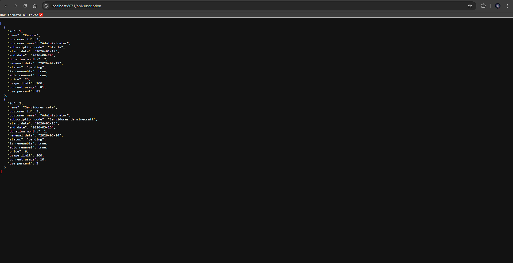
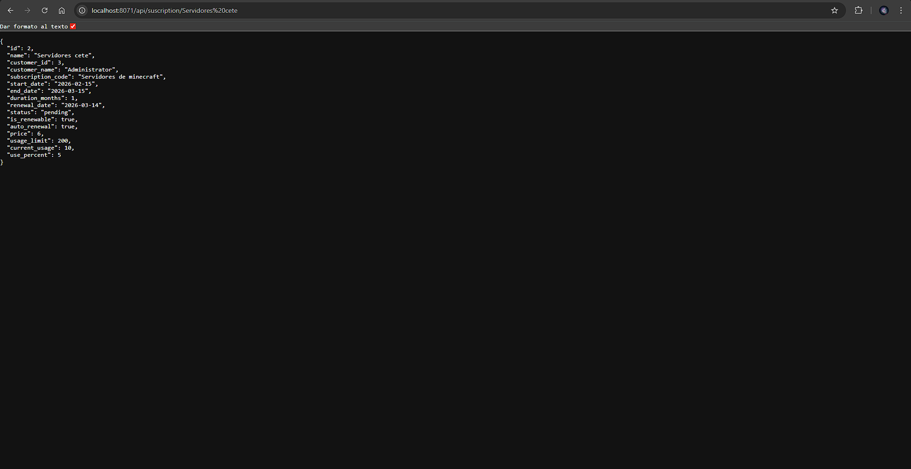

# [UT07](../../ut07/)

## PR0702

### Codigos
`controllers\api.py`
```python
# -*- coding: utf-8 -*-
from odoo import http
from odoo.http import request, Response
import json

class SubscriptionAPI(http.Controller):

    @http.route("/api/suscription", type="http", auth="public", methods=['GET'], csrf=False)
    def get_all_suscriptions(self, **kwargs):
        try:
            status_filter = request.params.get('status')
            
            page = int(request.params.get('page', 1))
            limit = 10
            offset = (page - 1) * limit
            
            domain = []
            if status_filter:
                allowed_status = ['active', 'expired', 'pending', 'cancelled']
                if status_filter not in allowed_status:
                    return Response(
                        json.dumps({'error': 'Bad Request', 'message': 'Estado no permitido'}),
                        content_type='application/json', status=400
                    )
                domain.append(('status', '=', status_filter))

            subscriptions = request.env['subscription.subscription'].sudo().search(
                domain, limit=limit, offset=offset
            )

            result = []
            for sub in subscriptions:
                result.append(self._format_subscription_data(sub))

            return Response(json.dumps(result), content_type='application/json', status=200)

        except Exception as e:
            return Response(json.dumps({'error': str(e)}), content_type='application/json', status=500)

    @http.route("/api/suscription/<string:name>", type="http", auth="public", methods=['GET'], csrf=False)
    def get_suscription_by_name(self, name):
        try:
            sub = request.env['subscription.subscription'].sudo().search([('name', '=', name)], limit=1)

            if not sub:
                return Response(
                    json.dumps({'error': 'Not Found', 'message': 'Suscripción no encontrada'}),
                    content_type="application/json", status=404
                )

            data = self._format_subscription_data(sub)
            return Response(json.dumps(data), content_type="application/json", status=200)

        except Exception as e:
            return Response(json.dumps({'error': str(e)}), content_type="application/json", status=500)

    def _format_subscription_data(self, sub):
        return {
            'id': sub.id,
            'name': sub.name,
            'customer_id': sub.customer_id.id,
            'customer_name': sub.customer_id.name,
            'subscription_code': sub.subscription_code,
            'start_date': str(sub.start_date) if sub.start_date else False,
            'end_date': str(sub.end_date) if sub.end_date else False,
            'duration_months': sub.duration_months,
            'renewal_date': str(sub.renewal_date) if sub.renewal_date else False,
            'status': sub.status,
            'is_renewable': sub.is_renewable,
            'auto_renewal': sub.auto_renewal,
            'price': sub.price,
            'usage_limit': sub.usage_limit,
            'current_usage': sub.current_usage,
            'use_percent': sub.use_percent,
        }
```
### Imagenes
Sin filtro

Con filtro
